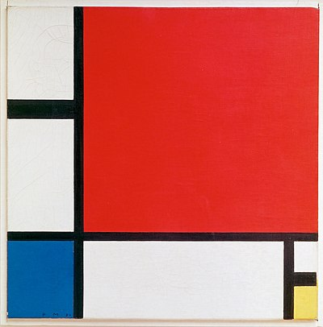
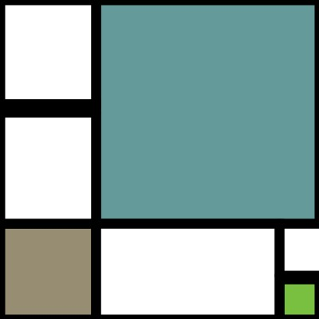

# Mondrian-Inspired Generative Art
For this week assignment, I wanted to recreate the oil painting below on python.

I decided to add a randomized component to this illustration, which resulted in a Mondrian-style painting in an assortment of colors. This was created using `py5`. Each time the sketch runs, the main color blocks are assigned random colors.

## How to create your own randomized version:
- Ensure you have 'py5' installed
- Run the script:
  python Assignment_2.py
  
